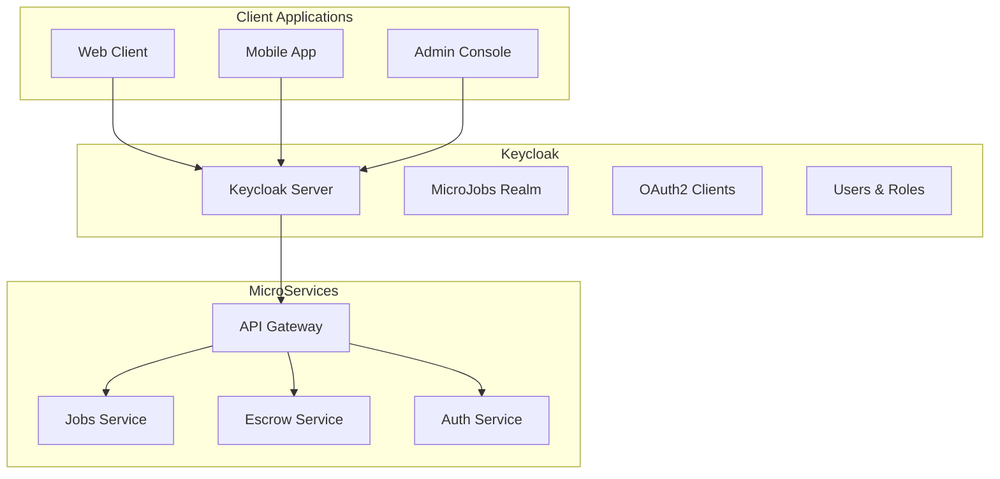

# Keycloak Integration Guide

## Overview

The MicroJobs Marketplace uses Keycloak as the identity and access management (IAM) solution for authentication and authorization. This guide covers the setup, configuration, and usage of Keycloak in our system.

## Architecture



## Keycloak Configuration

### Realm Setup

Our system uses a dedicated Keycloak realm called `microjobs` with the following configuration:

- **Realm Name**: microjobs
- **Display Name**: MicroJobs Marketplace
- **Registration**: Enabled
- **Email Verification**: Required
- **Brute Force Protection**: Enabled

### Clients

#### 1. API Gateway Client
- **Client ID**: `api-gateway`
- **Client Secret**: `api-gateway-secret`
- **Type**: Confidential
- **Grant Types**: Authorization Code, Client Credentials
- **Redirect URIs**: `http://localhost:8080/*`

#### 2. Admin Console Client
- **Client ID**: `admin-console`
- **Client Secret**: `admin-console-secret`
- **Type**: Confidential
- **Grant Types**: Authorization Code, Client Credentials
- **Redirect URIs**: `http://localhost:3000/*`

#### 3. Mobile App Client
- **Client ID**: `mobile-app`
- **Type**: Public
- **Grant Types**: Authorization Code
- **Redirect URIs**: `com.microjobs://callback`

### Roles

#### Realm Roles
- **admin**: System administrator with full access
- **tenant-admin**: Tenant administrator with limited access
- **client**: Job client who can post jobs
- **worker**: Job worker who can bid on jobs

#### Client Roles
- **api-gateway**: Service account for API Gateway
- **jobs-service**: Service account for Jobs Service
- **escrow-service**: Service account for Escrow Service

### Users

#### Demo Users
- **Admin**: `admin@microjobs.com` / `admin123`
- **Client**: `client@demo.com` / `password123`
- **Worker**: `worker@demo.com` / `password123`

## JWT Token Structure

Our JWT tokens contain the following claims:

```json
{
  "sub": "user-uuid",
  "preferred_username": "user@tenant.com",
  "email": "user@tenant.com",
  "tenant_id": "tenant-001",
  "realm_access": {
    "roles": ["client", "worker"]
  },
  "resource_access": {
    "api-gateway": {
      "roles": ["api-gateway"]
    }
  },
  "iat": 1640995200,
  "exp": 1640998800
}
```

## Multi-Tenancy

### Tenant Isolation

Our system supports multi-tenancy through:

1. **Tenant ID Extraction**: From JWT `tenant_id` claim or username domain
2. **Schema-per-Tenant**: Database isolation at schema level
3. **Role-based Access**: Tenant-specific roles and permissions

### Tenant Context Resolution

```java
@Component
public class TenantContextResolver {
    
    public Optional<TenantId> getCurrentTenant() {
        // Extract tenant from JWT token
        // Fallback to username domain extraction
    }
    
    public boolean hasRole(String role) {
        // Check realm and resource roles
    }
}
```

## Security Configuration

### Spring Security Setup

```java
@Configuration
@EnableWebSecurity
public class KeycloakSecurityConfig {
    
    @Bean
    public SecurityFilterChain filterChain(HttpSecurity http) throws Exception {
        return http
            .oauth2ResourceServer(oauth2 -> oauth2
                .jwt(jwt -> jwt.decoder(jwtDecoder()))
            )
            .authorizeHttpRequests(authz -> authz
                .requestMatchers("/actuator/**").permitAll()
                .anyRequest().authenticated()
            )
            .build();
    }
}
```

### JWT Validation

- **Issuer**: `http://localhost:8085/realms/microjobs`
- **JWK Set URI**: `http://localhost:8085/realms/microjobs/protocol/openid-connect/certs`
- **Token Lifespan**: 5 minutes (configurable)
- **Refresh Token**: 30 minutes

## API Gateway Integration

### Route Configuration

```yaml
spring.cloud.gateway.routes:
  - id: auth-service
    uri: lb://auth-service
    predicates:
      - Path=/api/auth/**
    filters:
      - StripPrefix=2
      - name: RequestRateLimiter
        args:
          redis-rate-limiter.replenishRate: 10
          redis-rate-limiter.burstCapacity: 20
```

### Circuit Breaker

```yaml
resilience4j.circuitbreaker:
  instances:
    auth-service:
      failure-rate-threshold: 50
      wait-duration-in-open-state: 30s
      sliding-window-size: 10
```

## Development Setup

### 1. Start Keycloak

```bash
# Start Keycloak with Docker Compose
docker-compose up -d keycloak

# Wait for Keycloak to be ready
curl -s http://localhost:8085/health/ready
```

### 2. Configure Keycloak

```bash
# Run the configuration script
./docker/keycloak/configure-keycloak.sh
```

### 3. Access Keycloak Admin Console

- **URL**: http://localhost:8085/admin
- **Username**: admin
- **Password**: admin123

### 4. Test Authentication

```bash
# Get access token
curl -X POST http://localhost:8085/realms/microjobs/protocol/openid-connect/token \
  -H "Content-Type: application/x-www-form-urlencoded" \
  -d "username=client@demo.com" \
  -d "password=password123" \
  -d "grant_type=password" \
  -d "client_id=api-gateway" \
  -d "client_secret=api-gateway-secret"

# Use token to access protected endpoint
curl -H "Authorization: Bearer $TOKEN" http://localhost:8080/api/jobs
```

## Production Considerations

### Security Hardening

1. **HTTPS Only**: Enable HTTPS in production
2. **Strong Passwords**: Enforce strong password policies
3. **Token Rotation**: Implement token rotation strategies
4. **Audit Logging**: Enable comprehensive audit logging
5. **Rate Limiting**: Implement rate limiting on authentication endpoints

### High Availability

1. **Keycloak Clustering**: Set up Keycloak in cluster mode
2. **Database**: Use external PostgreSQL database
3. **Load Balancing**: Use load balancer for Keycloak instances
4. **Backup**: Regular backup of Keycloak configuration

### Monitoring

1. **Health Checks**: Monitor Keycloak health endpoints
2. **Metrics**: Collect authentication metrics
3. **Logging**: Centralized logging for security events
4. **Alerting**: Set up alerts for authentication failures

## Troubleshooting

### Common Issues

#### 1. JWT Validation Failures
```bash
# Check JWT token structure
echo $TOKEN | cut -d. -f2 | base64 -d | jq
```

#### 2. CORS Issues
```yaml
# Ensure CORS is configured in Keycloak
keycloak:
  cors:
    allowed-origins: "*"
    allowed-methods: "*"
    allowed-headers: "*"
```

#### 3. Token Expiry
```java
// Handle token refresh
@RefreshScope
public class TokenRefreshService {
    public String refreshToken(String refreshToken) {
        // Implement token refresh logic
    }
}
```

### Debugging

#### Enable Debug Logging
```yaml
logging:
  level:
    org.springframework.security: DEBUG
    org.keycloak: DEBUG
    com.microjobs.shared.infrastructure.security: DEBUG
```

#### Keycloak Admin CLI
```bash
# Use Keycloak Admin CLI for troubleshooting
docker exec -it keycloak /opt/keycloak/bin/kcadm.sh config credentials \
  --server http://localhost:8085 --realm master --user admin --password admin123
```

## API Documentation

### Authentication Endpoints

#### Login
```http
POST /realms/microjobs/protocol/openid-connect/token
Content-Type: application/x-www-form-urlencoded

username=user@tenant.com&password=password&grant_type=password&client_id=api-gateway&client_secret=api-gateway-secret
```

#### User Info
```http
GET /realms/microjobs/protocol/openid-connect/userinfo
Authorization: Bearer $TOKEN
```

#### Logout
```http
POST /realms/microjobs/protocol/openid-connect/logout
Authorization: Bearer $TOKEN
```

### Protected Endpoints

All API endpoints require a valid JWT token:

```http
GET /api/jobs
Authorization: Bearer $TOKEN
X-Tenant-ID: tenant-001
```

## Best Practices

1. **Token Management**: Implement proper token storage and refresh
2. **Error Handling**: Handle authentication errors gracefully
3. **Logging**: Log security events for audit purposes
4. **Testing**: Write comprehensive tests for authentication flows
5. **Documentation**: Keep authentication documentation up to date

## References

- [Keycloak Documentation](https://www.keycloak.org/documentation)
- [Spring Security OAuth2](https://spring.io/projects/spring-security-oauth)
- [JWT.io](https://jwt.io/) - JWT token debugging
- [OAuth2 RFC](https://tools.ietf.org/html/rfc6749) - OAuth2 specification
